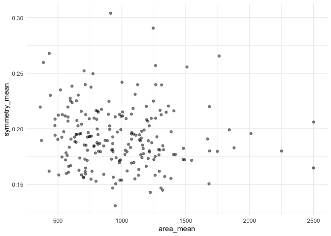

Mini Data Analysis Milestone 2
================

*To complete this milestone, you can either edit [this `.rmd`
file](https://raw.githubusercontent.com/UBC-STAT/stat545.stat.ubc.ca/master/content/mini-project/mini-project-2.Rmd)
directly. Fill in the sections that are commented out with
`<!--- start your work here--->`. When you are done, make sure to knit
to an `.md` file by changing the output in the YAML header to
`github_document`, before submitting a tagged release on canvas.*

# Welcome to the rest of your mini data analysis project!

In Milestone 1, you explored your data. and came up with research
questions. This time, we will finish up our mini data analysis and
obtain results for your data by:

- Making summary tables and graphs
- Manipulating special data types in R: factors and/or dates and times.
- Fitting a model object to your data, and extract a result.
- Reading and writing data as separate files.

We will also explore more in depth the concept of *tidy data.*

**NOTE**: The main purpose of the mini data analysis is to integrate
what you learn in class in an analysis. Although each milestone provides
a framework for you to conduct your analysis, it’s possible that you
might find the instructions too rigid for your data set. If this is the
case, you may deviate from the instructions – just make sure you’re
demonstrating a wide range of tools and techniques taught in this class.

# Instructions

**To complete this milestone**, edit [this very `.Rmd`
file](https://raw.githubusercontent.com/UBC-STAT/stat545.stat.ubc.ca/master/content/mini-project/mini-project-2.Rmd)
directly. Fill in the sections that are tagged with
`<!--- start your work here--->`.

**To submit this milestone**, make sure to knit this `.Rmd` file to an
`.md` file by changing the YAML output settings from
`output: html_document` to `output: github_document`. Commit and push
all of your work to your mini-analysis GitHub repository, and tag a
release on GitHub. Then, submit a link to your tagged release on canvas.

**Points**: This milestone is worth 50 points: 45 for your analysis, and
5 for overall reproducibility, cleanliness, and coherence of the Github
submission.

**Research Questions**: In Milestone 1, you chose two research questions
to focus on. Wherever realistic, your work in this milestone should
relate to these research questions whenever we ask for justification
behind your work. In the case that some tasks in this milestone don’t
align well with one of your research questions, feel free to discuss
your results in the context of a different research question.

# Learning Objectives

By the end of this milestone, you should:

- Understand what *tidy* data is, and how to create it using `tidyr`.
- Generate a reproducible and clear report using R Markdown.
- Manipulating special data types in R: factors and/or dates and times.
- Fitting a model object to your data, and extract a result.
- Reading and writing data as separate files.

# Setup

Begin by loading your data and the tidyverse package below:

``` r
library(datateachr) # <- might contain the data you picked!
library(tidyverse)
library(here) # <- task 4 required
library(readr)
```

# Task 1: Process and summarize your data

From milestone 1, you should have an idea of the basic structure of your
dataset (e.g. number of rows and columns, class types, etc.). Here, we
will start investigating your data more in-depth using various data
manipulation functions.

### 1.1 (1 point)

First, write out the 4 research questions you defined in milestone 1
were. This will guide your work through milestone 2:

<!-------------------------- Start your work below ---------------------------->

1.  Does the worst radius (radius_worst) of tumors significantly differ
    between malignant and benign tumors?
2.  Does the fractal dimension of tumors relate to the concavity in both
    malignant and benign tumors?
3.  Among tumors diagnosed as malignant, which features (e.g.,
    smoothness_mean, compactness_mean, etc.) are most correlated with
    larger tumor size (e.g., area_mean)?
4.  Original Question: What is the relationship between mean area
    (area_mean) and the mean of concave points (concave_points_mean) in
    both malignant and benign tumors? Since I already have to two
    questions that explore the relationship between two numerical
    variables, I would like to change the question to explore how many
    malignant (M) and benign (B) tumors are there in each category of
    the symmetry_mean variable, and what what proportion do they
    represent in each group?
    <!----------------------------------------------------------------------------->

Here, we will investigate your data using various data manipulation and
graphing functions.

### 1.2 (8 points)

Now, for each of your four research questions, choose one task from
options 1-4 (summarizing), and one other task from 4-8 (graphing). You
should have 2 tasks done for each research question (8 total). Make sure
it makes sense to do them! (e.g. don’t use a numerical variables for a
task that needs a categorical variable.). Comment on why each task helps
(or doesn’t!) answer the corresponding research question.

Ensure that the output of each operation is printed!

Also make sure that you’re using dplyr and ggplot2 rather than base R.
Outside of this project, you may find that you prefer using base R
functions for certain tasks, and that’s just fine! But part of this
project is for you to practice the tools we learned in class, which is
dplyr and ggplot2.

**Summarizing:**

1.  Compute the *range*, *mean*, and *two other summary statistics* of
    **one numerical variable** across the groups of **one categorical
    variable** from your data.
2.  Compute the number of observations for at least one of your
    categorical variables. Do not use the function `table()`!
3.  Create a categorical variable with 3 or more groups from an existing
    numerical variable. You can use this new variable in the other
    tasks! *An example: age in years into “child, teen, adult, senior”.*
4.  Compute the proportion and counts in each category of one
    categorical variable across the groups of another categorical
    variable from your data. Do not use the function `table()`!

**Graphing:**

6.  Create a graph of your choosing, make one of the axes logarithmic,
    and format the axes labels so that they are “pretty” or easier to
    read.
7.  Make a graph where it makes sense to customize the alpha
    transparency.

Using variables and/or tables you made in one of the “Summarizing”
tasks:

8.  Create a graph that has at least two geom layers.
9.  Create 3 histograms, with each histogram having different sized
    bins. Pick the “best” one and explain why it is the best.

Make sure it’s clear what research question you are doing each operation
for!

<!------------------------- Start your work below ----------------------------->

``` r
# Question 1: Does the worst radius (radius_worst) of tumors significantly differ between malignant and benign tumors?

# *Summarizing*:  Compute the *range*, *mean*, and *two other summary statistics* of **one numerical variable** across the groups of **one categorical variable** from your data.

radius_worst_summary <- cancer_sample %>%
  group_by(diagnosis) %>%
  summarize(
    Range = max(radius_worst) - min(radius_worst),
    Mean = mean(radius_worst),
    Median = median(radius_worst),
    SD = sd(radius_worst)
  )

print(radius_worst_summary)
```

    ## # A tibble: 2 × 5
    ##   diagnosis Range  Mean Median    SD
    ##   <chr>     <dbl> <dbl>  <dbl> <dbl>
    ## 1 B          11.9  13.4   13.4  1.98
    ## 2 M          23.2  21.1   20.6  4.28

``` r
# The code above first group the patients based on their 'diagnosis', which allows the comparision of summary statistics across patients with malignant and benign tumors. Then the *range*, *mean*, *median*, and *standard deviation* are computed. These statistics show that the worst radius of malignant tumors has greater range, mean, median, and standard deviation than benign tumor. So the worst radius of tumors are different between malignant and benign tumors.

# *Graphing*: Create a graph that has at least two geom layers.

radius_worst_summary %>%
  ggplot(aes(x= diagnosis, y = Mean)) +
  geom_bar(stat = "identity", width = 0.7) +
  geom_errorbar(
    aes(ymin = Mean - SD, ymax = Mean + SD),
    width = 0.3
  )+ theme_minimal()
```

<!-- -->

``` r
# The code above creates a bar chart with the two diagnosis in the x-axis and mean worst radius in the y-axis. The error bars are also plotted based on the standard deviation of worst radius. The graph informs that the mean worst radius of malignant and benign tumors is different.
```

``` r
# Question 2: Does the fractal dimension of tumors relate to the concavity in both malignant and benign tumors?

# *Summarizing*: Create a categorical variable with 3 or more groups from an existing numerical variable.

cancer_sample <- cancer_sample %>% 
  mutate(fractal_dimension_level = case_when(
    fractal_dimension_mean <= quantile(fractal_dimension_mean, 0.33) ~ "Low",
    fractal_dimension_mean <= quantile(fractal_dimension_mean, 0.66) ~ "Medium",
    TRUE ~ "High"))

# The code above create a categorical variable named 'fractal_dimension_level' from the 'fractal_dimension_mean' variable. The observations that are smaller than 33% of fractal_dimension_mean are sorted to the 'Low' group. The observations that are smaller than 66% of fractal_dimension_mean but higher than 33% of it are sorted to the 'Medium' group. The others are in the 'High' group. This code assesses if tumors with different levels of fractal dimensions show different concavities in both malignant and benign categories

# *Graphing*: Make a graph where it makes sense to customize the alpha transparency.

cancer_sample %>%
  ggplot(aes(x = fractal_dimension_mean, y = concavity_mean)) +
  geom_point(aes(color = fractal_dimension_level), alpha = 0.5) +
  theme_minimal()
```

<!-- -->

``` r
# The code produces a scatterplot that may have overlapped data points. So it makes sense to adjust the alpha transparency to differentiate between areas with single data points and those with overlapping data points. By plotting the fractal_dimension_mean against the concavity_mean, we can identify potential patterns or correlations between the two measurements. Coloring based on fractal_dimension_level allows us to see if tumors with a higher (or lower) fractal dimension consistently show particular concavity patterns. Based on the graph, there is no significant correlations between fractal dimension and mean concavity in all three fractal dimension groups. 
```

``` r
# Question 3: Among tumors diagnosed as malignant, which features (e.g., smoothness_mean, compactness_mean, etc.) are most correlated with larger tumor size (e.g., area_mean)?

# *Summarizing*: Compute the number of observations for at least one of your categorical variables.

cancer_sample %>%
  count(diagnosis = "M")
```

    ## # A tibble: 1 × 2
    ##   diagnosis     n
    ##   <chr>     <int>
    ## 1 M           569

``` r
# The code above gives an overview about how many patients have malignant tumor in the cancer_sample dataset. The result does not directly answer the research question. However, we need to isolate observations with 'M' diagnosis before conducting any correlational analysis. Checking the number of observations provides a reference on the size of data we are handling.

# *Graphing*: Make a graph where it makes sense to customize the alpha transparency.

cancer_sample %>%
  filter(diagnosis == "M") %>%
  ggplot(aes(x = area_mean, y = symmetry_mean)) +
  geom_point(alpha = 0.5) +
  theme_minimal()
```

<!-- -->

``` r
# The code generates a scatterplot with the mean area in x-axis and mean symmetry in the y-axis to explore the correlation between the two variables for patients with malignant tumor. To fully answer the research question, 'y = symmetry_mean' in line 164 can be replaced by other variables of interest.
```

``` r
# Question 3: How many malignant (M) and benign (B) tumors are there in each category of the symmetry_mean variable, and what proportion do they represent in each group?

# *Summarizing*: Compute the proportion and counts in each category of one categorical variable across the groups of another categorical variable from your data.

cancer_newsample <- cancer_sample %>% 
  mutate(symmetry_category = case_when(
    symmetry_mean <= quantile(symmetry_mean, 0.33) ~ "Low",
    symmetry_mean <= quantile(symmetry_mean, 0.66) ~ "Medium",
    TRUE ~ "High")) %>%
group_by(symmetry_category, diagnosis) %>%
  summarize(counts = n(), .groups = "drop") %>%
  mutate('proportion(%)' = counts / sum(counts)*100)

print(cancer_newsample)
```

    ## # A tibble: 6 × 4
    ##   symmetry_category diagnosis counts `proportion(%)`
    ##   <chr>             <chr>      <int>           <dbl>
    ## 1 High              B             88           15.5 
    ## 2 High              M            106           18.6 
    ## 3 Low               B            151           26.5 
    ## 4 Low               M             37            6.50
    ## 5 Medium            B            118           20.7 
    ## 6 Medium            M             69           12.1

``` r
# The code addresses the research question by first dividing the symmetry_mean variable to three groups, including *Low*, *Medium*, and *High*. Then the numbers of malignant and benign tumors in each symmetry_mean category are counted. The proportions they represent in the whole data are also computed. 

# *Graphing*: Create a graph of your choosing, make one of the axes logarithmic, and format the axes labels so that they are "pretty" or easier to read.

ggplot(cancer_newsample, aes(x = interaction(symmetry_category, diagnosis), y = `proportion(%)`, fill = diagnosis)) +
  geom_bar(stat="identity") +
  scale_y_log10(breaks = scales::trans_breaks("log10", function(x) 10^x),
                labels = scales::trans_format("log10", scales::math_format(10^.x))) +
  theme_minimal() +
  labs(x = "Symmetry Category and Diagnosis", y = "Proportion (log scale)") +
  scale_fill_manual(values = c("B" = "blue", "M" = "red"), name = "Diagnosis") +
  theme(axis.text.x = element_text(angle = 45, hjust = 1))
```

<!-- -->

``` r
# The code plots a bar chart with log-scaled proportion on the y-axis. Each bar represents the proportion of malignant or benign tumor in 3 categories of symmetry_mean variable. The code answers the questions by giving a clear visual representation of the distribution of benign and malignant tumors across the symmetry_mean categories.
```

<!----------------------------------------------------------------------------->

### 1.3 (2 points)

Based on the operations that you’ve completed, how much closer are you
to answering your research questions? Think about what aspects of your
research questions remain unclear. Can your research questions be
refined, now that you’ve investigated your data a bit more? Which
research questions are yielding interesting results?

<!------------------------- Write your answer here ---------------------------->

Question 1: The *Summarizing* task perfectly address the research
question by comparing range, mean, standard deviation, and median of
worst radius across malignant and benign tumors. The result shows that
malignant tumour has greater worst radius, which meets my expectation.
However, in order to test how significant the difference is, some
statistical analysis, such as t-test, may need to be executed. Also, to
explore if radius is an indicator of malignance of tumor, the research
question can be refined to compare the mean radius between two types of
diagnosis.

Question 2: The tasks I did get me closer to answer this question. From
the plot, it seems that the mean fractal dimension and mean concavity
are not correlated. However, some statistical analysis are required to
measure the correlation and significance. To further investigate this
question, two separate plots each with the data of maligant and benign
tumors may be helpful.

Question 3: I partially answer the research question by conducting those
tasks. Since there are many variables that may be correlated with mean
area, different variables should be put on the y-axis to investigate
their relationships with mean area. Based on the plot I made, it is
interesting to find that mean symmetry and mean area may not correlated
with each other because I assumed larger tumor may be more asymmetrical.

Question 4: The tasks perfectly answer the question by computing the
proportions and numbers of observations in each interaction group. The
result is a bit confusing because there are more maligant tumours in
High symmetry category but fewer in Low and Medium symmetry categories.
This question can be refined further to fully understand the role of
symmetry measure as a diagnostic tool of tumor.
<!----------------------------------------------------------------------------->

# Task 2: Tidy your data

In this task, we will do several exercises to reshape our data. The goal
here is to understand how to do this reshaping with the `tidyr` package.

A reminder of the definition of *tidy* data:

- Each row is an **observation**
- Each column is a **variable**
- Each cell is a **value**

### 2.1 (2 points)

Based on the definition above, can you identify if your data is tidy or
untidy? Go through all your columns, or if you have \>8 variables, just
pick 8, and explain whether the data is untidy or tidy.

<!--------------------------- Start your work below --------------------------->

First, pick 8 variables

``` r
cancer_subset <- cancer_sample %>%
  select(ID, diagnosis, radius_mean, texture_mean, compactness_mean, smoothness_mean, perimeter_mean, symmetry_mean)
```

To verify if each row is an **observation**, I will use the observations
in the *ID* column because each ID would correspond to a unique patients
if there are not repetitive observations.

``` r
is_distinct <- n_distinct(cancer_subset$ID) == nrow(cancer_subset)

print(is_distinct)
```

    ## [1] TRUE

To verify that each cell has a **value**

``` r
cells_value <- cancer_subset%>% 
  summarise_all(~all(!is.na(.))) 

print(cells_value)
```

    ## # A tibble: 1 × 8
    ##   ID    diagnosis radius_mean texture_mean compactness_mean smoothness_mean
    ##   <lgl> <lgl>     <lgl>       <lgl>        <lgl>            <lgl>          
    ## 1 TRUE  TRUE      TRUE        TRUE         TRUE             TRUE           
    ## # ℹ 2 more variables: perimeter_mean <lgl>, symmetry_mean <lgl>

The first code chunk selects 8 **variables**. Then the “TRUE” results
generated by the second and third code chunks verify that each row is a
distinct observation and each cell in all columns has a value. So my
data is tidy.
<!----------------------------------------------------------------------------->

### 2.2 (4 points)

Now, if your data is tidy, untidy it! Then, tidy it back to it’s
original state.

If your data is untidy, then tidy it! Then, untidy it back to it’s
original state.

Be sure to explain your reasoning for this task. Show us the “before”
and “after”.

<!--------------------------- Start your work below --------------------------->

This is the original dataset

``` r
glimpse(cancer_subset)
```

    ## Rows: 569
    ## Columns: 8
    ## $ ID               <dbl> 842302, 842517, 84300903, 84348301, 84358402, 843786,…
    ## $ diagnosis        <chr> "M", "M", "M", "M", "M", "M", "M", "M", "M", "M", "M"…
    ## $ radius_mean      <dbl> 17.990, 20.570, 19.690, 11.420, 20.290, 12.450, 18.25…
    ## $ texture_mean     <dbl> 10.38, 17.77, 21.25, 20.38, 14.34, 15.70, 19.98, 20.8…
    ## $ compactness_mean <dbl> 0.27760, 0.07864, 0.15990, 0.28390, 0.13280, 0.17000,…
    ## $ smoothness_mean  <dbl> 0.11840, 0.08474, 0.10960, 0.14250, 0.10030, 0.12780,…
    ## $ perimeter_mean   <dbl> 122.80, 132.90, 130.00, 77.58, 135.10, 82.57, 119.60,…
    ## $ symmetry_mean    <dbl> 0.2419, 0.1812, 0.2069, 0.2597, 0.1809, 0.2087, 0.179…

The original data is in wide format. To untidy it, I will convert it to
long format.

``` r
cancer_long <- cancer_subset %>%
  pivot_longer(
    cols = c(radius_mean, texture_mean, compactness_mean, smoothness_mean, perimeter_mean, symmetry_mean),
    names_to = "feature",
    values_to = "value")

glimpse(cancer_long)
```

    ## Rows: 3,414
    ## Columns: 4
    ## $ ID        <dbl> 842302, 842302, 842302, 842302, 842302, 842302, 842517, 8425…
    ## $ diagnosis <chr> "M", "M", "M", "M", "M", "M", "M", "M", "M", "M", "M", "M", …
    ## $ feature   <chr> "radius_mean", "texture_mean", "compactness_mean", "smoothne…
    ## $ value     <dbl> 17.99000, 10.38000, 0.27760, 0.11840, 122.80000, 0.24190, 20…

The code above puts columns, including radius_mean, texture_mean,
compactness_mean, smoothness_mean, perimeter_mean, and symmetry_mean,
into a new column called *feature*, and it puts the values into a single
column

To convert it back to wide format:

``` r
cancer_wide <- cancer_long %>%
  pivot_wider(
    names_from = feature,
    values_from = value)

glimpse(cancer_wide)
```

    ## Rows: 569
    ## Columns: 8
    ## $ ID               <dbl> 842302, 842517, 84300903, 84348301, 84358402, 843786,…
    ## $ diagnosis        <chr> "M", "M", "M", "M", "M", "M", "M", "M", "M", "M", "M"…
    ## $ radius_mean      <dbl> 17.990, 20.570, 19.690, 11.420, 20.290, 12.450, 18.25…
    ## $ texture_mean     <dbl> 10.38, 17.77, 21.25, 20.38, 14.34, 15.70, 19.98, 20.8…
    ## $ compactness_mean <dbl> 0.27760, 0.07864, 0.15990, 0.28390, 0.13280, 0.17000,…
    ## $ smoothness_mean  <dbl> 0.11840, 0.08474, 0.10960, 0.14250, 0.10030, 0.12780,…
    ## $ perimeter_mean   <dbl> 122.80, 132.90, 130.00, 77.58, 135.10, 82.57, 119.60,…
    ## $ symmetry_mean    <dbl> 0.2419, 0.1812, 0.2069, 0.2597, 0.1809, 0.2087, 0.179…

``` r
glimpse(cancer_subset)
```

    ## Rows: 569
    ## Columns: 8
    ## $ ID               <dbl> 842302, 842517, 84300903, 84348301, 84358402, 843786,…
    ## $ diagnosis        <chr> "M", "M", "M", "M", "M", "M", "M", "M", "M", "M", "M"…
    ## $ radius_mean      <dbl> 17.990, 20.570, 19.690, 11.420, 20.290, 12.450, 18.25…
    ## $ texture_mean     <dbl> 10.38, 17.77, 21.25, 20.38, 14.34, 15.70, 19.98, 20.8…
    ## $ compactness_mean <dbl> 0.27760, 0.07864, 0.15990, 0.28390, 0.13280, 0.17000,…
    ## $ smoothness_mean  <dbl> 0.11840, 0.08474, 0.10960, 0.14250, 0.10030, 0.12780,…
    ## $ perimeter_mean   <dbl> 122.80, 132.90, 130.00, 77.58, 135.10, 82.57, 119.60,…
    ## $ symmetry_mean    <dbl> 0.2419, 0.1812, 0.2069, 0.2597, 0.1809, 0.2087, 0.179…

Comparing cancer_wide and cancer_subset shows that the dataset is
converted back to original state.
<!----------------------------------------------------------------------------->

### 2.3 (4 points)

Now, you should be more familiar with your data, and also have made
progress in answering your research questions. Based on your interest,
and your analyses, pick 2 of the 4 research questions to continue your
analysis in the remaining tasks:

<!-------------------------- Start your work below ---------------------------->

1.  Does the worst radius (radius_worst) of tumors significantly differ
    between malignant and benign tumors?
2.  Does the fractal dimension of tumors relate to the concavity in both
    malignant and benign tumors?

<!----------------------------------------------------------------------------->

Explain your decision for choosing the above two research questions.

<!--------------------------- Start your work below --------------------------->

I choose those two questions because they are specific and related to
particular variables. For question 1, more analysis should be done to
explore the difference between the two variables. As I suggested in
*Question 1.3*, two separate plots each with the data of maligant and
benign tumors may be helpful for answering Question 2. So organizing the
dataset is a good step before conducting further analysis.
<!----------------------------------------------------------------------------->

Now, try to choose a version of your data that you think will be
appropriate to answer these 2 questions. Use between 4 and 8 functions
that we’ve covered so far (i.e. by filtering, cleaning, tidy’ing,
dropping irrelevant columns, etc.).

(If it makes more sense, then you can make/pick two versions of your
data, one for each research question.)

<!--------------------------- Start your work below --------------------------->

For Question 1:

``` r
q1_data <- cancer_sample %>%
  select(diagnosis, radius_worst) %>%
  arrange(radius_worst)

head(q1_data)
```

    ## # A tibble: 6 × 2
    ##   diagnosis radius_worst
    ##   <chr>            <dbl>
    ## 1 B                 7.93
    ## 2 B                 8.68
    ## 3 B                 8.95
    ## 4 B                 8.96
    ## 5 B                 9.08
    ## 6 B                 9.09

For Question 2:

``` r
q2_data <- cancer_sample %>%
  select(diagnosis, fractal_dimension_mean, concavity_mean, fractal_dimension_level) %>%
  filter(fractal_dimension_level == "High") %>%
  group_by(diagnosis)

head(q2_data)
```

    ## # A tibble: 6 × 4
    ## # Groups:   diagnosis [1]
    ##   diagnosis fractal_dimension_mean concavity_mean fractal_dimension_level
    ##   <chr>                      <dbl>          <dbl> <chr>                  
    ## 1 M                         0.0787         0.300  High                   
    ## 2 M                         0.0974         0.241  High                   
    ## 3 M                         0.0761         0.158  High                   
    ## 4 M                         0.0745         0.0937 High                   
    ## 5 M                         0.0739         0.186  High                   
    ## 6 M                         0.0824         0.227  High

# Task 3: Modelling

## 3.0 (no points)

Pick a research question from 1.2, and pick a variable of interest
(we’ll call it “Y”) that’s relevant to the research question. Indicate
these.

<!-------------------------- Start your work below ---------------------------->

**Research Question**: Does the fractal dimension of tumors relate to
the concavity in both malignant and benign tumors?

**Variable of interest**: concavity_mean

<!----------------------------------------------------------------------------->

## 3.1 (3 points)

Fit a model or run a hypothesis test that provides insight on this
variable with respect to the research question. Store the model object
as a variable, and print its output to screen. We’ll omit having to
justify your choice, because we don’t expect you to know about model
specifics in STAT 545.

- **Note**: It’s OK if you don’t know how these models/tests work. Here
  are some examples of things you can do here, but the sky’s the limit.

  - You could fit a model that makes predictions on Y using another
    variable, by using the `lm()` function.
  - You could test whether the mean of Y equals 0 using `t.test()`, or
    maybe the mean across two groups are different using `t.test()`, or
    maybe the mean across multiple groups are different using `anova()`
    (you may have to pivot your data for the latter two).
  - You could use `lm()` to test for significance of regression
    coefficients.

<!-------------------------- Start your work below ---------------------------->

``` r
stat_test <- lm(concavity_mean ~ fractal_dimension_mean, data = cancer_sample)

print(stat_test)
```

    ## 
    ## Call:
    ## lm(formula = concavity_mean ~ fractal_dimension_mean, data = cancer_sample)
    ## 
    ## Coefficients:
    ##            (Intercept)  fractal_dimension_mean  
    ##                 -0.150                   3.803

Fit a model that makes predictions on concavity_mean using
fractal_dimension_mean.
<!----------------------------------------------------------------------------->

## 3.2 (3 points)

Produce something relevant from your fitted model: either predictions on
Y, or a single value like a regression coefficient or a p-value.

- Be sure to indicate in writing what you chose to produce.
- Your code should either output a tibble (in which case you should
  indicate the column that contains the thing you’re looking for), or
  the thing you’re looking for itself.
- Obtain your results using the `broom` package if possible. If your
  model is not compatible with the broom function you’re needing, then
  you can obtain your results by some other means, but first indicate
  which broom function is not compatible.

<!-------------------------- Start your work below ---------------------------->

``` r
library(broom)

tidy_stat_test <- tidy(stat_test)
print(tidy_stat_test)
```

    ## # A tibble: 2 × 5
    ##   term                   estimate std.error statistic  p.value
    ##   <chr>                     <dbl>     <dbl>     <dbl>    <dbl>
    ## 1 (Intercept)              -0.150    0.0282     -5.32 1.52e- 7
    ## 2 fractal_dimension_mean    3.80     0.446       8.52 1.48e-16

I produced a prediction on concavity_mean using fractal_dimension_mean.
The broom function works for my model and extracts p.values from my
model. Based on the tibble produced, fractal_dimension_mean is not a
significant predictor of concavity_mean.
<!----------------------------------------------------------------------------->

# Task 4: Reading and writing data

Get set up for this exercise by making a folder called `output` in the
top level of your project folder / repository. You’ll be saving things
there.

## 4.1 (3 points)

Take a summary table that you made from Task 1, and write it as a csv
file in your `output` folder. Use the `here::here()` function.

- **Robustness criteria**: You should be able to move your Mini Project
  repository / project folder to some other location on your computer,
  or move this very Rmd file to another location within your project
  repository / folder, and your code should still work.
- **Reproducibility criteria**: You should be able to delete the csv
  file, and remake it simply by knitting this Rmd file.

<!-------------------------- Start your work below ---------------------------->

``` r
write_csv(radius_worst_summary, here::here("output", "milestone2_radius_worst_summary.csv"))
```

The summary table I take is radius_worst_summary. I write it into a file
named “milestone2_radius_worst_summary.csv” and put the file in a folder
named “output”.
<!----------------------------------------------------------------------------->

## 4.2 (3 points)

Write your model object from Task 3 to an R binary file (an RDS), and
load it again. Be sure to save the binary file in your `output` folder.
Use the functions `saveRDS()` and `readRDS()`.

- The same robustness and reproducibility criteria as in 4.1 apply here.

<!-------------------------- Start your work below ---------------------------->

``` r
saveRDS(stat_test, here::here("output", "stat_test.RDS"))
```

Save the stat_test in a file named “stat_test.RDS” to a folder named
“output”

``` r
readRDS(here::here("output", "stat_test.RDS"))
```

    ## 
    ## Call:
    ## lm(formula = concavity_mean ~ fractal_dimension_mean, data = cancer_sample)
    ## 
    ## Coefficients:
    ##            (Intercept)  fractal_dimension_mean  
    ##                 -0.150                   3.803

By reading this file, I can confirm it has the model object generated in
Task 3.
<!----------------------------------------------------------------------------->

# Overall Reproducibility/Cleanliness/Coherence Checklist

Here are the criteria we’re looking for.

## Coherence (0.5 points)

The document should read sensibly from top to bottom, with no major
continuity errors.

The README file should still satisfy the criteria from the last
milestone, i.e. it has been updated to match the changes to the
repository made in this milestone.

## File and folder structure (1 points)

You should have at least three folders in the top level of your
repository: one for each milestone, and one output folder. If there are
any other folders, these are explained in the main README.

Each milestone document is contained in its respective folder, and
nowhere else.

Every level-1 folder (that is, the ones stored in the top level, like
“Milestone1” and “output”) has a `README` file, explaining in a sentence
or two what is in the folder, in plain language (it’s enough to say
something like “This folder contains the source for Milestone 1”).

## Output (1 point)

All output is recent and relevant:

- All Rmd files have been `knit`ted to their output md files.
- All knitted md files are viewable without errors on Github. Examples
  of errors: Missing plots, “Sorry about that, but we can’t show files
  that are this big right now” messages, error messages from broken R
  code
- All of these output files are up-to-date – that is, they haven’t
  fallen behind after the source (Rmd) files have been updated.
- There should be no relic output files. For example, if you were
  knitting an Rmd to html, but then changed the output to be only a
  markdown file, then the html file is a relic and should be deleted.

Our recommendation: delete all output files, and re-knit each
milestone’s Rmd file, so that everything is up to date and relevant.

## Tagged release (0.5 point)

You’ve tagged a release for Milestone 2.

### Attribution

Thanks to Victor Yuan for mostly putting this together.
